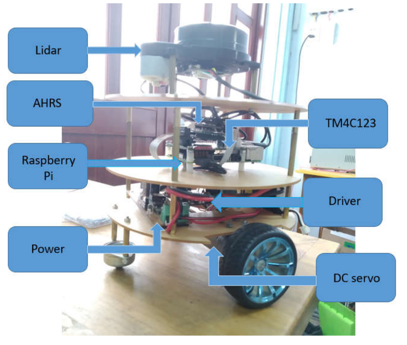

# Automotive vehicle base on ROS: the movebase part
The movebase part help user jump over some basic step like: design car, hardware, low-level control firmware and can quickly develop their own dapplication.

## feature
- Simple car's model.
- Hardware for controller with TM4C123 as the main microcontroller, can be pluged into Raspberry board.
- firmware for TM4C123, include ROSserial to connect with ROS in Raspberry, PID controller, odomery,etc

## Tutorial
You can find tutorial [here](http://www.payitforward.edu.vn/forum/threads/3172/)

## Software
The base software for multiple robot [here](https://github.com/tuanti1997qn/LuanVan). 
